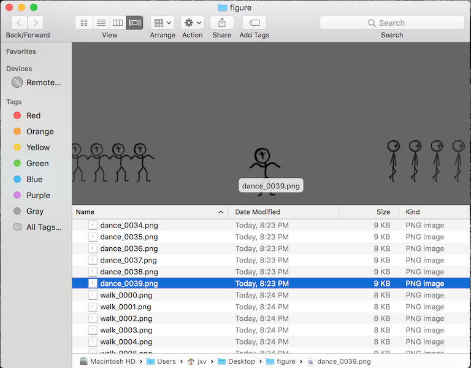

# animate-frames

`animate-frames` is a workflow tool for converting sprite frames into a spritesheet and [`animate`](https://github.com/jxv/animate) compatible metadata files.

```
Usage:
  animate-frames [--animation <key> <frame0.png> <frame1.png> ...] [--image <spritesheet.png>] [--metadata <target.json>] [--fps <int>] [--yaml]

Example:
animate-frames \
  --animation Idle idle_0000.png idle_0001.png idle_0002.png \
  --animation Walk walk_0000.png walk_0001.png walk_0002.png \
  --spritesheet sprite.png \
  --metadata sprite.yaml \
  --image "path/to/sprite.png" \
  [--fps 60] \ # default: 24fps
  [--yaml] # default is JSON
```

## Workflow

This is an example workflow using Krita and animate to create sprites iteratively.

### Krita

[Krita](https://krita.org/en/) is a profesional level drawing and digital painting program.
It's also open source and works wonderfully with a drawing tablet.
Most importantly, it allows for drawing animation with onion skinning.

Here are the example stick figure animations -- walk and dance.

[`walk.kra`](propaganda/walk.kra)


[`dance.kra`](propaganda/dance.kra)


### Generate individual animation frames

In order to represent the animation, each project file will renderer as frames with a postfix'ed number.

Don't forget to change the `basename`.


Now, there's a folder with all the frames.



Notice that there are duplicates of frames.
This is because ech frame implictly attaches a unit of time.
In this case, each frame lasts for 1/24th second.

### Use `animate-frames` for spritesheet and metadata file

Removing frame duplication, composing a spritesheet, and inferring metadata is the core of what `animate-frames` does.
What cannot be inferred are required as arguments.

Here's the script the find frames then generate the spritesheet and metadata files.

[`compile-frames.sh`](propaganda/compile-frames.sh)

```shell
#! /bin/sh

match() {
	echo `find ./ -name "$1" -print0 | xargs -0 ls`
}

walk=$(match "walk_*.png")
dance=$(match "dance_*.png")

animate-frames \
	--spritesheet figure.png \
	--image "data/figure.png" \
	--metadata figure.yaml \
	--animation Walk $walk \
	--animation Dance $dance \
	--yaml \ # JSON is default
	--fps 24

```

__Generated files__

A clip describes area of each frame on the spritesheet.
An animation is defined by a list of the clip indices and delays (in seconds).

[`figure.yaml`](propaganda/figure.yaml)

```yaml
image: "data/figure.png"
alpha: null
clips:
- [0, 0, 91, 135, 58, 80] # 0
- [91, 0, 87, 135, 52, 78] # 1
- [178, 0, 86, 134, 53, 76] # 2
- [264, 0, 96, 131, 69, 75] # 3
- [0, 135, 77, 135, 60, 78] # 4
- [77, 135, 79, 131, 66, 74] # 5
- [156, 135, 79, 130, 67, 74] # 6
- [235, 135, 86, 132, 60, 75] # 7
- [0, 270, 44, 143, 26, 86] # 8
- [44, 270, 40, 139, 19, 81] # 9
- [84, 270, 61, 141, 38, 83] # 10
- [145, 270, 71, 137, 41, 81] # 11
- [216, 270, 53, 139, 29, 84] # 12
- [269, 270, 44, 137, 27, 83] # 13
- [0, 413, 61, 139, 37, 83] # 14
- [61, 413, 63, 141, 35, 84] # 15
animations:
  "Dance":
  - [0, 0.2083]
  - [1, 0.2083]
  - [2, 0.2083]
  - [3, 0.2083]
  - [4, 0.2083]
  - [5, 0.2083]
  - [6, 0.2083]
  - [7, 0.2083]
  "Walk":
  - [8, 0.2083]
  - [9, 0.2083]
  - [10, 0.2083]
  - [11, 0.2083]
  - [12, 0.2083]
  - [13, 0.2083]
  - [14, 0.2083]
  - [15, 0.2083]
```

All the frames are collapsed into one spritesheet.

[`figure.png`](propaganda/figure.png)


### Preview animation

Use [animate-preview](https://github.com/jxv/animate-preview) to preview the generated spritesheet and metadata files.


```shell
animate-preview --target figure.yaml --image figure.png --high-dpi --watch
```


### Build into game

When building a game, you'll want to use the [`animate`](https://github.com/jxv/animate) and [`animate-sdl2`](https://github.com/jxv/animate-sdl2) libraries to load and draw the sprites. The [`animate`](https://github.com/jxv/animate) has functions to load the generated files.

